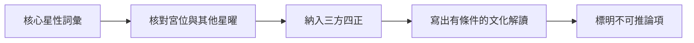

# 十四主星的閱讀方法

## 一句話先懂

讀主星要分「核心詞彙、所處條件、可用限制」三層，不把短詞當結論。

## 先備知識

- [[紫微斗數十四主星-索引]]
- [[紫微斗數星曜層級與作用分工]]

## 學習目標

1. 知道主星在本課是宮位事件的核心符號，不是唯一原因。
2. 學會用三層流程讀每一顆主星。
3. 為後續 [[雙星組合的閱讀方法]] 建立共通邊界。

## 自足小抄

- **核心詞彙**：課程用來說明星曜的穩定象徵字。
- **所處條件**：包括宮位、同場其他星曜與三方四正。
- **可用限制**：星曜不直接決定吉凶，短句也不是個人預測。

## 白話比喻

主星像一個故事的主題字；宮位像場景，其他星曜像同場角色。只看主題字無法寫出整個故事。比喻只幫助記步驟，不是規則證據。

## 三層閱讀流程

- **看什麼**：一次閱讀要從星性詞彙走到條件與限制。
- **怎麼看**：每走一步就問「還缺哪個條件？」；箭頭是閱讀次序，不是事件因果。
- **不能推出什麼**：完成流程也不能把傳統命理變成科學預測，更不能替真實人下專業結論。

## 逐步理解

### 先讀核心，不先讀斷句

核心詞彙像「索引字」，用來組織資訊。「皇帝」「財庫」「策士」都是課內意象，不等於某人的現實身分。

### 再加條件

I3 與 I4 都提醒，講義的單星落宮短句是延伸推導，要搭配三方四正；輔星、煞星與四化也會改變表現。

### 最後寫限制

閱讀結果要用「在本課的符號框架中」「還需其他條件」表述，不寫成事件、疾病、性格或關係的斷語。

## 虛構例子

虛構課堂上，學生小紙看到「天機＝策士」的記憶詞。他先記下「思考、謀略、流動」，接著檢查場景與其他星曜，最後只寫「可用這組詞觀察」。他不替任何真實人判定個性或未來。

## 常見誤解

> [!warning] 形容詞不是結果
> 「穩定」「善變」「享樂」是符號閱讀的起點。少了宮位、其他星曜與三方四正，就不能把它們變成人格診斷。

## 自我檢核

1. 主星三層讀法是什麼？
2. 「某星是財庫，所以一定有錢」哪裡出錯？

> [!success]- 參考答案
> 1. 先讀核心詞彙，再檢查宮位、其他星曜與三方四正，最後標明限制；不能推出真實財務或命運。
> 2. 它把象徵詞當成無條件結果；「財庫」只是課內意象，不能推出個人財產。

## 來源卡

| 上游索引 | 對應節名 | 證據強度 | 本篇使用 |
|---|---|---|---|
| I3 | 主星介紹、全單元明示限制 | 主星導論為本課單一來源；六份講義共同警語交叉支持限制 | 主星為核心符號與三層讀法 |
| I4 | 全單元限制 | 八顆星同課配對，講義重複「事件不會自動發生」限制 | 後半主星共通邊界 |

## 負責任使用

> [!info] 使用邊界
> 傳統命理課程的文化與符號閱讀框架，非科學實證的預測工具，也不取代醫療、法律、心理、財務或關係專業判斷。
