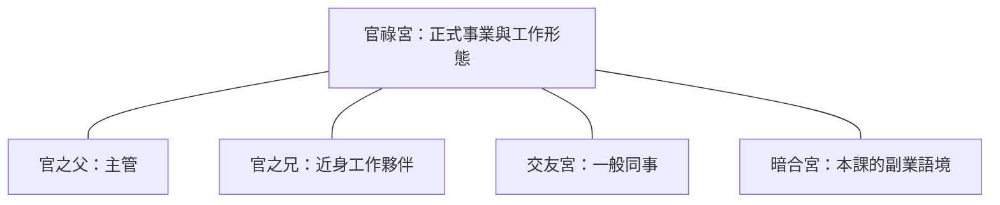

# 官祿宮的工作形式與主管

> [!abstract] 一句話先懂
> 官祿宮在本課偏向工作形式，主管與夥伴則要用衍生角色分開閱讀。

## 先備知識

- 先讀 [[十二宮位與轉宮法入門]]，了解衍生角色不是新的第十三宮。
- 回到 [[紫微斗數十二宮位與身宮-索引]]，確認官祿宮的學習位置。

## 學習目標

- 分清工作形式、工作行業、主管、近身夥伴與一般同事。
- 說出「官之父」「官之兄」在本課各指向哪種角色。
- 不把官祿宮當成職涯測驗或求職決策器。

## 自足小抄

- **本宮重點**：正式事業與工作形態。
- **主管**：本課用「官之父」作衍生角色。
- **近身工作夥伴**：本課用「官之兄」作衍生角色。
- **一般同事**：回到交友宮；**副業**：課內轉看暗合宮。
- **範圍收窄**：現代判工作行業以命宮主星優先，官祿更偏工作形態。

## 白話比喻

把官祿宮想成一張工作舞台配置圖：舞台本身是工作形式，導演像「官之父」，身旁搭檔像「官之兄」，一般工作人員另放在交友語境。這只是記憶分工，不是職涯配對或升遷預告。

> [!warning] 職涯邊界
> 宮位不能測量能力、薪資、錄取或升遷，也不能替代勞動條件、技能、興趣與專業職涯諮詢。

## 逐步理解

1. **先看本宮責任**：官祿宮在本課主要處理正式事業與工作形態。
2. **再做角色轉換**：主管不是官祿本宮本身，而以「官之父」標示；近身夥伴以「官之兄」標示。
3. **把一般同事分出去**：一般同事屬交友宮，不能和真正一起做事的近身夥伴混寫。
4. **收窄行業推論**：索引明示現代判行業以命宮主星優先，官祿不能單獨精準分類職業，還要融合命宮與三方四正。

## 圖解：VG 官祿與衍生角色

- **看什麼**：看官祿本宮與四種相鄰工作角色的分工。
- **怎麼看**：先確認問題是工作形式、主管、近身夥伴、一般同事或副業，再沿線找到課內語境。
- **不能推出什麼**：不能推出適合職業、錄取、薪資、升遷、主管好壞或工作成敗。

## 虛構例子

虛構的校慶專案中，活動形式是舞台展演，指導老師是主管，核心執行搭檔是近身夥伴，其他支援同學是一般協力。這可練習角色分類；不能用分類預測誰會升遷、離職或成功。

## 常見誤解

- **誤解：官祿宮直接等於工作行業。** I10 明示官祿更偏工作形態，不能單獨當職業分類器。
- **誤解：主管與一般同事都看同一層。** 本課分成官之父與交友宮。
- **誤解：副業看暗合就能預測收入。** 暗合只是課內關聯語境，不提供收入結論。

## 自我檢核

1. 本課如何區分主管、近身工作夥伴與一般同事？
2. 官祿宮能否單獨判斷適合的工作行業？

> [!success] 參考答案
> 1. 主管用官之父、近身夥伴用官之兄、一般同事回到交友；仍不能判定人物能力或合作結果。  
> 2. 不能。I10 把官祿收窄為工作形態，且要求融合命宮主星與三方四正，不能取代職涯證據。

## 延伸閱讀

- 角色對照：[[交友宮的朋友部屬與工具]]。
- 副業關聯：[[暗合宮與六合互動]]。
- 導航與方法：[[紫微斗數十二宮位與身宮-索引]]、[[十二宮位與轉宮法入門]]。

## 來源卡

| 欄位 | 內容 |
|---|---|
| 上游索引 | I10「S09 十二宮位抽取索引」 |
| 對應節名 | S09E010 官祿宮 |
| 證據強度 | 兩源一致支持工作形式、主管／夥伴、事業規模與工作異動；索引明示官之父、官之兄及行業範圍收窄 |
| 保留限制 | 命宮與官祿主星及三方四正須融合；單用官祿不能精準斷行業，更不能作職涯建議 |

## 負責任使用

傳統命理課程的文化與符號閱讀框架，非科學實證的預測工具，也不取代醫療、法律、心理、財務或關係專業判斷。
