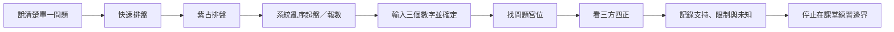

# 紫占入門與初階判讀

## 一句話先懂

本課紫占初階是「先定問題，再報數起盤、找宮位與三方四正」，只能作有邊界的課堂練習。

## 先備知識

- [[紫微斗數三方四正入門]]：先理解本宮與相關宮位的基本關係。
- [[紫微斗數十天干四化-索引]]：知道本篇位於十干單元的初階應用。
- [[紫微斗數學習安全邊界]]：先確認不可用來替現實高風險事項下決定。

## 學習目標

- 依 I9 重述紫占初階操作順序。
- 先找問題宮位，再看三方四正與好壞落點，不只數星曜。
- 把練習範圍限制在本課明示的簡單、大方向閱讀。

## 自足小抄

- **紫占**：本課用快速排盤與報數起盤做的初階課堂練習。
- **報數起盤**：在 App 的紫占排盤中選系統亂序起盤，輸入三個數字後確定。
- **問題宮位**：依問題主題先找對應宮位。
- **三方四正**：不只看單一宮位，也看課程指定的相關宮位組合；不是自動算命公式。

## 白話比喻

像做閱讀理解：先看題目問什麼，再回文章找相關段落，不能先圈滿關鍵字後硬編答案。這個比喻只幫助掌握順序，不證明占測能預測未來。

## 逐步理解

1. **先把問題說清楚**：初學練習聚焦單一、可描述的問題；本課建議先問三個月內，較長期回到流年層次。
2. **進入操作流程**：快速排盤 → 紫占排盤 → 系統亂序起盤（報數）→ 輸入三個數字 → 確定。
3. **找問題宮位**：先確認問題在課內對應哪個宮位，不從滿盤星曜反推無限事件。
4. **看三方四正**：沿課內結構看相關宮位與星曜，記錄支持、限制與相反訊號。
5. **只做大方向整理**：吉星、煞星數量在本課只提供大方向；各半時更要說明「好在哪裡、限制在哪裡」。
6. **停止在課堂邊界**：正式紫占教學不在本索引內，不能把初階流程用於醫療、法律、心理、財務或關係決策。

> [!danger] 近場安全邊界
> 不要用紫占決定是否就醫、提告、投資、停藥、分手或其他高風險事項。這些問題必須依現實資料與合格專業意見處理。

## 初階流程圖（VF）

- **看什麼**：流程從問題出發，到起盤、找宮位、看三方四正，再以限制收尾。
- **怎麼看**：逐步完成，不跳過問題宮位，也不只靠吉星／煞星數量作答。
- **不能推出什麼**：不能由流程證明占測有效、預知事件、替任何真實人物下命運結論，或取代專業決策。

## 虛構例子

> [!example] 低風險課堂題
> 虛構學生小辰把問題寫成「未來三個月如何安排校內閱讀專題？」他用三個未記錄的練習數字完成起盤，只練習找問題宮位與三方四正，最後列出「支持線索、限制、未知」，不把結果當成選課或升學命令。

## 常見誤解

> [!warning] 星曜數量不是自動答案
> 即使課內把吉星、煞星數量當大方向，仍需分辨它們落在哪裡、與問題是否相關；一半一半更不能硬選好或壞。

> [!warning] 三個月是初學範圍，不是準確度保證
> 這只是本課給初學者的時間邊界，沒有提供預測效度或成功率。

## 自我檢核

1. **問：紫占初階第一步是報三個數字嗎？** 答：不是；先說清楚問題，再操作起盤。這個順序仍不能證明預測有效。
2. **問：看到吉星較多就能回答「一定會」嗎？** 答：不能；本課只允許大方向，還要看問題宮位、三方四正、限制與未知。
3. **問：能用本流程決定醫療或投資嗎？** 答：不能；須使用現實證據與合格專業判斷。

## 來源卡

| 索引 ID | 對應節名 | 證據強度 | 使用限制 |
|---|---|---|---|
| I9 | 紫占跨來源校勘 | 操作流程由同課文字與講義互相支持 | App 高密度命盤細字不納入 |
| I9 | 全單元老師明示限制 | 初階範圍與大方向明示 | 正式教學在後續；本篇不補猜 |
| I9 | 紫占詞典 | 核准術語 | 原講義畫面與真實命例值不使用 |

下一步：用 [[紫微斗數新手判讀工作紙]] 記錄「問題、證據、限制、未知」，不要把練習結果當成現實指令。

## 負責任使用

> [!warning] 固定聲明
> 傳統命理課程的文化與符號閱讀框架，非科學實證的預測工具，也不取代醫療、法律、心理、財務或關係專業判斷。
