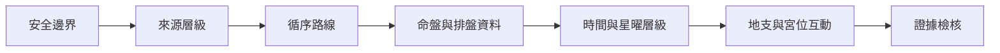

# 紫微斗數入門與判讀方法-索引

> [!abstract] 一句話先懂
> 入門的重點不是背答案，而是依序確認資料、結構、時間、層級、互動與證據限制。

## 先備知識

- [[紫微斗數大師課-索引]]：先看這組入門筆記在全課的位置。
- 本頁是主題 MOC，不要求先認識任何主星。

## 學習目標

- 能依學習階梯安排 A01–A11 的閱讀順序。
- 能找到安全、來源、排盤、時間、星曜層級、宮位互動與證據檢核的對應筆記。
- 能說明「先有問題，再找證據與限制」比從滿盤無限反推更安全。

## 自足小抄

- **命盤結構**：課內把星曜、宮位、四化與時間層放在同一閱讀框架。
- **三方四正**：提醒讀者不能只盯一個點，仍要看與本宮相連的結構。
- **證據檢核**：分辨來源是否配對、是否有衝突、哪些地方待考，以及結論不能超過什麼邊界。

## 白話比喻

這組筆記像實驗課前的安全訓練：先學儀器、讀刻度、確認樣本，再記錄能觀察到什麼。比喻只幫助安排步驟，不證明命理符號能預測事件。

## 逐步理解

1. 邊界與來源：[[紫微斗數學習安全邊界]]、[[本課的紫微斗數來源與流派說法]]。
2. 學習總路線：[[紫微斗數循序學習路線]]。
3. 盤與資料：[[紫微斗數命盤結構導覽]]、[[紫微斗數排盤與真太陽時]]。
4. 時間與星曜層次：[[紫微斗數本命大限流年判讀順序]]、[[紫微斗數星曜層級與作用分工]]。
5. 位置與互動：[[紫微斗數地支與宮位基礎]]、[[紫微斗數三方四正入門]]、[[紫微斗數空宮借對宮]]。
6. 收尾檢核：[[紫微斗數判讀證據檢核表]]。

## 學習階梯（VF）

- **看什麼**：七層由安全與來源開始，到結構、互動及最後檢核。
- **怎麼看**：每層先完成學習目標再前進；卡住時回到前一層補定義。
- **不能推出什麼**：完成階梯不代表具備替真人預測或提供專業建議的資格。

## 虛構例子

> [!example] 阿湛的閱讀順序
> 虛構學生阿湛先看到一張空宮示意圖，但他沒有直接套結論，而是回到命盤結構與三方四正，再用檢核表寫下「只可作課內符號練習」。

## 常見誤解

> [!warning] 背熟術語不等於完成判讀
> 索引反覆要求合看宮位、星曜層級、四化、時間與三方四正；任何單一詞都不足以推出真人事件。

## 自我檢核

1. 為什麼安全邊界排在最前？答案：它決定後續材料可被怎麼使用；不能因為懂術語就跳過限制。
2. 判讀前最後應做什麼？答案：用 [[紫微斗數判讀證據檢核表]] 檢查問題、證據與限制；不能把缺證據處補成肯定句。

## 來源卡

| 上游 | 對應節名 | 證據強度 |
|---|---|---|
| I1 | Ch.01–Ch.10 跨卷順序 | 強於本課結構；不證明預測效果。 |
| I2 | 學習步驟、命盤結構與時間層 | 多數課有配對來源；源流課例外。 |
| I10 | 十二宮導論與跨課一致原則 | 宮位導論為單一來源，專題課多為配對來源。 |

## 負責任使用

> [!warning] 固定聲明
> 傳統命理課程的文化與符號閱讀框架，非科學實證的預測工具，也不取代醫療、法律、心理、財務或關係專業判斷。
