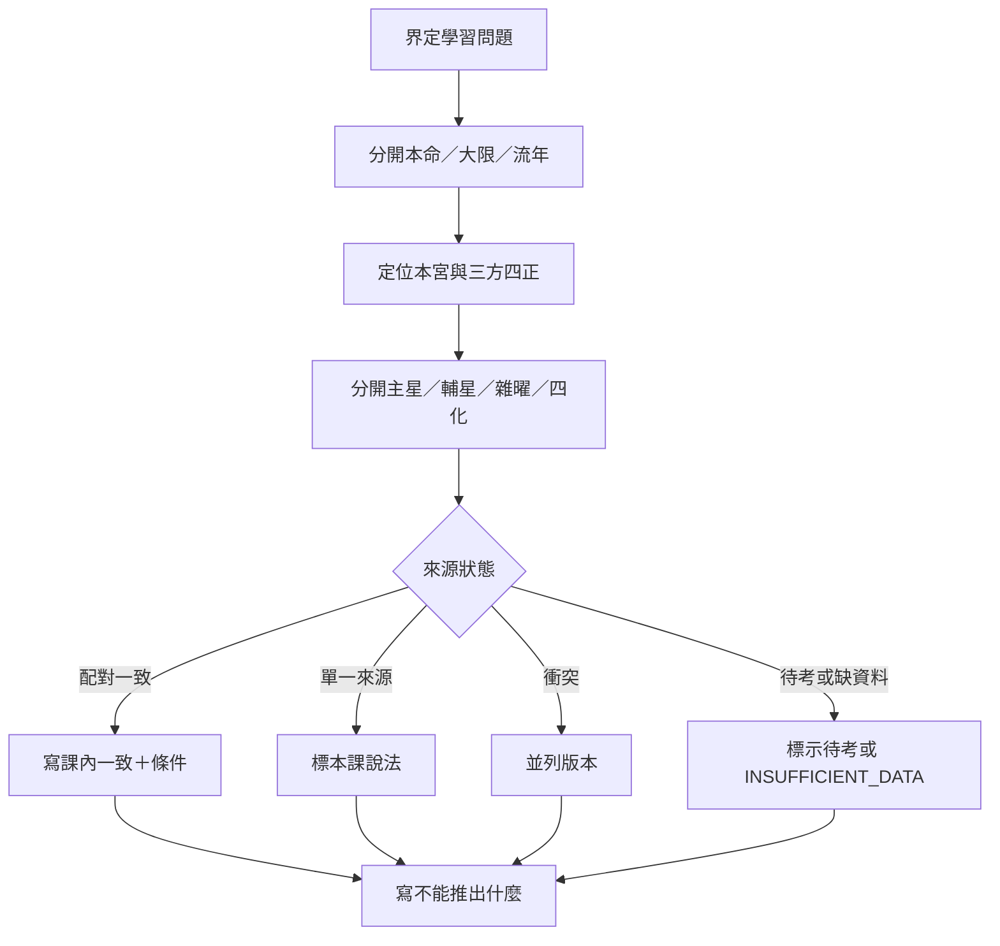

# 紫微斗數判讀證據檢核表

> [!abstract] 一句話先懂
> 先把問題說清楚，再逐層找來源與條件，最後主動寫出證據不足和不能推出的結論。

## 先備知識

- [[紫微斗數學習安全邊界]]：先知道哪些用途必須停止。
- [[紫微斗數入門與判讀方法-索引]]：回查命盤、時間、星曜與宮位的入門順序。

## 學習目標

- 能用問題→證據→限制流程檢查一段課內判讀。
- 能區分配對來源、單一來源、衝突與待考。
- 能在答案中同時寫出條件與不能推出什麼。

## 自足小抄

- **問題導向**：I9 明示要從問題出發、從事件回盤找證據，不從滿盤無限反推事件。
- **證據層級**：配對逐字稿與講義可支持課程內一致；單一來源只能寫「本課說法」；衝突須並列；待考不得升格。
- **條件層**：時間、宮位、主輔雜曜、四化、三方四正與版本都可能限制一句話。
- **責任層**：任何健康、法律、心理、財務、關係、性別或宗教主張都不能越過專業邊界。

## 白話比喻

像寫自然科報告：先寫研究問題，再列觀察、控制條件與誤差，最後只回答資料支持的範圍。比喻只說明證據紀律，不把命理變成科學實驗。

## 逐步理解

1. **寫問題**：一句話界定要學的概念，不替真人預設事件。
2. **標時間**：分開本命、大限、流年，不把不同層混在同一句。
3. **標宮位**：寫出本宮及必要的三方四正、對宮或其他互動。
4. **標星曜層**：分開主星、輔星、雜曜，不用單顆星作完整答案。
5. **標四化與版本**：確認化祿、化權、化科、化忌及所屬時間；庚年保留 A／B。
6. **查來源**：回到 I1–I10 的一致、補充、衝突、限制；不讀 raw 補細節。
7. **寫證據強度**：配對、單一來源、衝突或待考四選一，必要時寫 `INSUFFICIENT_DATA`。
8. **寫不能推出什麼**：明示非預測、非診斷、非專業決策，也不把比喻當證據。

## 問題到限制流程（VF）

- **看什麼**：所有路徑都從明確問題出發，最後都必須抵達限制，而不是只挑有利證據。
- **怎麼看**：依時間、宮位、星曜、四化、來源順序檢查；來源狀態不同，就使用不同寫法。
- **不能推出什麼**：通過流程只代表筆記忠於本課證據邊界，不代表判讀已被科學驗證或可替真人決策。

## 可勾選清單

| 檢查項 | 通過條件 |
|---|---|
| 問題 | 一句話可回答，沒有先假定真人事件 |
| 時間 | 本命、大限、流年分欄 |
| 宮位 | 本宮與必要互動位置已列 |
| 星曜 | 主、輔、雜曜分層，未單星直斷 |
| 四化 | 作用方向、時間與版本已標 |
| 來源 | 只用 I1–I10；單一、衝突、待考沒有被抹平 |
| 高風險 | 健康、法律、心理、財務、關係、性別、宗教有近場警語 |
| 結尾 | 明寫條件與不能推出什麼 |

- **看什麼**：清單把內容完整性與責任邊界放在同一張表。
- **怎麼看**：逐列確認；任一列缺失就回到相應入門筆記，不以流暢文案掩蓋。
- **不能推出什麼**：全部打勾也不能保證命理判讀正確、事件發生或專業風險已排除。

## 虛構例子

> [!example] 一段合格練習
> 虛構題目只提供「某宮、主星甲、輔星乙、流年四化丙」。學生寫：「本課可練習分層比較；仍缺三方四正與來源版本，`INSUFFICIENT_DATA: 完整條件`，不能替真人預測。」

## 常見誤解

> [!warning] 資料多不等於證據強
> 十個符號若都來自單一、待考或互相衝突的來源，仍不能拼成肯定故事；證據強度取決於來源狀態與限制，不是字數。

## 自我檢核

1. 遇到單一來源應怎麼寫？答案：標「本課說法」及缺口；不能升格為外部共識。
2. 庚年 A／B 能否投票選一版？答案：不能；兩版並列，除非上游有新核准證據。
3. 全部欄位齊全能否替人做醫療或財務決定？答案：不能；本課不取代任何專業判斷。

## 下一步

- 使用 [[紫微斗數新手判讀工作紙]] 實作本清單，待考與來源關係則回到 [[紫微斗數來源地圖與待考索引]]。

## 來源卡

| 上游 | 對應節名 | 證據強度與檢核用途 |
|---|---|---|
| R5 | Phase 4 D1–D3 證據關卡 | 強；成品事實只取核准索引。 |
| I1–I2 | 課程結構、基礎盤面與時間 | 支持先修與資料分層；源流課為單一來源。 |
| I3–I4 | 十四主星 | 多課配對支持單星非必然與三方四正限制。 |
| I5–I6 | 雙星組合 | 多課配對支持強弱、條件與古訣限制。 |
| I7–I8 | 輔星、雜曜與四化 | 支持層級與作用方向；雜曜導論為單一來源。 |
| I9 | 十干、版本、解方與紫占 | 支持問題導向、庚年衝突及宗教效力邊界。 |
| I10 | 十二宮與跨課原則 | 支持宮位、三方四正及健康／關係／財務邊界。 |

## 負責任使用

> [!warning] 固定聲明
> 傳統命理課程的文化與符號閱讀框架，非科學實證的預測工具，也不取代醫療、法律、心理、財務或關係專業判斷。
