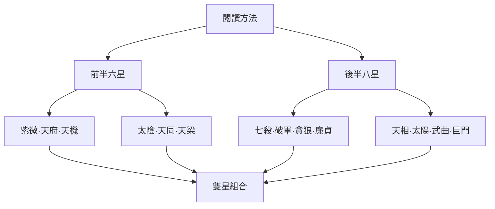

# 紫微斗數十四主星索引

## 一句話先懂

十四主星是十四組課內象徵詞彙，要先學單星，再學條件與組合。

## 先備知識

- 先讀 [[紫微斗數大師課-索引]] 了解全課位置。
- 讀過 [[紫微斗數星曜層級與作用分工]]，知道主星不是整張盤的唯一資訊。

## 學習目標

1. 用 [[十四主星的閱讀方法]] 區分核心詞彙、條件與限制。
2. 找到十四顆主星的單星筆記。
3. 學完單星後，前往 [[紫微斗數雙星組合-索引]] 練習組合語意。

## 自足小抄

**主星**在本課是理解宮位事件的核心符號。「核心」不等於「單獨決定」：還要合看宮位、其他星曜與三方四正。

## 白話比喻

可以把十四主星想成故事裡的十四種「角色功能」：每種功能有一組容易記的詞，但故事怎麼發展，還取決於場景與其他角色。這個比喻只是記憶橋梁，不是命理規則證據。

## 十四星學習地圖

- **看什麼**：先經過閱讀方法，再分支學完十四星，最後才進入雙星。
- **怎麼看**：先讀方法篇，再依清單逐顆讀；箭頭表示學習順序，不是命運因果。
- **不能推出什麼**：不能因某顆星的名稱或卡片意象，就斷定真實人物的性格、成就或事件。

## 逐步理解

### 第一步：先學讀法

- [[十四主星的閱讀方法]]

### 第二步：前半六星

- [[主星紫微的核心意象與限制]]
- [[主星天府的核心意象與限制]]
- [[主星天機的核心意象與限制]]
- [[主星太陰的核心意象與限制]]
- [[主星天同的核心意象與限制]]
- [[主星天梁的核心意象與限制]]

### 第三步：後半八星

- [[主星七殺的核心意象與限制]]
- [[主星破軍的核心意象與限制]]
- [[主星貪狼的核心意象與限制]]
- [[主星廉貞的核心意象與限制]]
- [[主星天相的核心意象與限制]]
- [[主星太陽的核心意象與限制]]
- [[主星武曲的核心意象與限制]]
- [[主星巨門的核心意象與限制]]

### 第四步：再學組合

完成單星詞彙後，再進入 [[雙星組合的閱讀方法]]，不要把兩顆星當成兩張卡直接相加。

## 虛構例子

虛構學生小空想學「紫微七殺」，他先讀紫微與七殺的單星篇，然後才進雙星篇。這個例子只示範學習次序，不含任何真實命例。

## 常見誤解

> [!warning] 主星不是人格標籤
> 星曜短詞是本課的文化符號詞彙。缺宮位、其他星曜與三方四正時，不能用來定罪或預測一個人。

## 自我檢核

1. 為什麼不應直接從星名推人格？
2. 學完單星後，下一步是什麼？

> [!success]- 參考答案
> 1. 因為主星只是一層詞彙，條件上還要合看宮位、其他星曜與三方四正；不能推出真實人的性格或命運。
> 2. 前往雙星組合，但仍要保留條件與限制；不能把組合當成自動預測公式。

## 來源卡

| 上游索引 | 對應節名 | 證據強度 | 本篇使用 |
|---|---|---|---|
| I3 | 主星介紹、紫微至天梁 | 六星為同課雙源核心一致；導論為本課單一來源框架 | 主星讀法與前半六星導航 |
| I4 | 七殺至巨門 | 八星同課配對，核心詞彙經索引校勘 | 後半八星導航與共通限制 |

## 負責任使用

> [!info] 使用邊界
> 傳統命理課程的文化與符號閱讀框架，非科學實證的預測工具，也不取代醫療、法律、心理、財務或關係專業判斷。
