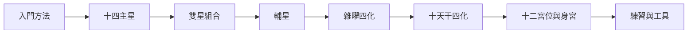

# 紫微斗數循序學習路線

> [!abstract] 一句話先懂
> 先認核心星曜，再學組合、修飾、時間與宮位，最後才做有邊界的綜合練習。

## 先備知識

- [[紫微斗數入門與判讀方法-索引]]：本篇所屬的入門導航。
- [[紫微斗數學習安全邊界]]：整條路線共同使用的限制。

## 學習目標

- 能依八個主題安排閱讀順序。
- 能解釋為何不能跳過單星與層級，直接背雙星或宮位結論。
- 能在每階段找到回查來源與練習的入口。

## 自足小抄

- **元件**：主星、輔星、雜曜與四化等課內符號。
- **組合**：兩顆主星同現時形成的課內新語意，仍受強弱與條件影響。
- **位置與時間**：宮位說明主題，本命／大限／流年說明不同時間層；兩者不能混成單一答案。

## 白話比喻

像學閱讀一篇文章：先認字，再看詞組、修飾語、段落位置與時間背景，最後才回答閱讀題。這只是學習順序比喻，不是命理有效性的證據。

## 逐步理解

1. **入門與方法**：先學來源、安全、盤面與證據檢核。
2. **十四主星**：把主星當宮位事件的核心符號，但不單星直斷。
3. **雙星組合**：學兩星如何形成新語意，並判斷哪顆較明顯。
4. **輔星**：理解參與執行與修飾表現的角色。
5. **雜曜與四化**：先分辨氣氛層與祿、權、科、忌的作用方向。
6. **十天干四化**：查本課採用表，同時保留庚年 A／B 衝突。
7. **十二宮位與身宮**：把符號放回主題、互動與時間語境。
8. **練習與工具**：只用虛構案例，逐步寫出證據、條件及不能推出什麼。

## 八階路線（VF）

- **看什麼**：課程由單一元件逐步走到組合、條件、位置與練習。
- **怎麼看**：依箭頭前進；若下一階出現不懂的術語，就回前一階重讀定義與限制。
- **不能推出什麼**：箭頭只表示教學依賴，不代表人生事件會按此順序發生。

## 虛構例子

> [!example] 小祐的跳級問題
> 虛構學生小祐直接背雙星短句，卻不知道主星與四化條件。他回到 [[紫微斗數十四主星-索引]] 與 [[紫微斗數雜曜與四化-索引]]，再重新做練習。這只示範補先修，不是替人論命。

## 常見誤解

> [!warning] 後面的內容不等於比較準
> 宮位與練習整合較多條件，但仍只是本課文化符號框架；複雜度增加不會自動變成科學證據。

## 自我檢核

1. 雙星之前要先讀什麼？答案：[[紫微斗數十四主星-索引]]；不能把組合當成沒有來源的新星。
2. 十天干表遇到庚年怎麼辦？答案：保留雙版本並查看證據邊界；不能裁決唯一表。

## 主題入口

- [[紫微斗數入門與判讀方法-索引]]
- [[紫微斗數十四主星-索引]]
- [[紫微斗數雙星組合-索引]]
- [[紫微斗數輔星-索引]]
- [[紫微斗數雜曜與四化-索引]]
- [[紫微斗數十天干四化-索引]]
- [[紫微斗數十二宮位與身宮-索引]]
- [[紫微斗數練習與工具-索引]]

## 來源卡

| 上游 | 對應節名 | 證據強度 |
|---|---|---|
| I1 | Ch.01–Ch.10 跨卷延續關係 | 強於教材章節順序。 |
| I2 | 學習紫微斗數的正確步驟與觀念 | 逐字稿與講義核心一致；不證明預測力。 |

## 負責任使用

> [!warning] 固定聲明
> 傳統命理課程的文化與符號閱讀框架，非科學實證的預測工具，也不取代醫療、法律、心理、財務或關係專業判斷。
