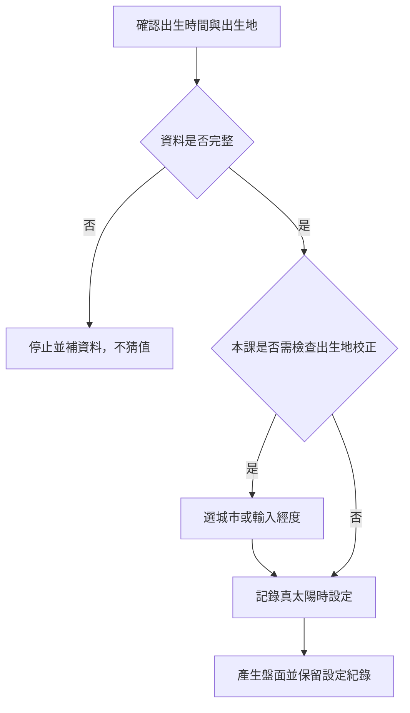

# 紫微斗數排盤與真太陽時

> [!abstract] 一句話先懂
> 本課排盤時會檢查出生地與真太陽時設定，尤其不把同一時區直接當成相同地方時間。

## 先備知識

- [[紫微斗數命盤結構導覽]]：先知道排盤輸出有哪些資料層。
- [[紫微斗數入門與判讀方法-索引]]：本篇所屬主題導航。

## 學習目標

- 能說出本課為何在海外出生情境檢查真太陽時。
- 能分辨「選城市」與「輸入經度」兩種課內操作路徑。
- 能記錄設定與來源，而不自行補猜未驗證的數字。

## 自足小抄

- **真太陽時**：本課排盤流程中的時間校正選項，會考慮出生地位置。
- **城市路徑**：在軟體中選擇城市。
- **經度路徑**：輸入經度；同課講義把這條路徑標為推薦。
- **限制**：索引支持操作概念，不支持把未視覺驗證的介面數值抄成定稿。

## 白話比喻

像寄包裹前確認地址：只知道時區像只知道縣市，還要確認更具體的位置設定。這是操作記憶比喻，不證明排盤結果能預測人生。

## 逐步理解

1. 先確認出生時間與出生地資料是否完整，缺資料就先停下，不猜值。
2. 若涉及海外出生，本課要求檢查真太陽時；即使同屬加八時區，也可能因經度不同而出現校正差異。
3. 軟體提供「選城市」或「輸入經度」兩種方式；本課講義將後者標為推薦。
4. 產生盤面後，記錄使用的資料與設定，讓之後能重現操作。
5. 使用 [[紫微斗數判讀證據檢核表]] 檢查：操作步驟只是產生課內盤面，不是預測有效性的證據。

## 排盤校正流程（VF）

- **看什麼**：資料完整性在排盤前，真太陽時設定在產生盤面前，最後保留可重現紀錄。
- **怎麼看**：沿判斷節點走；遇到缺資料就停止，不用想像值補洞。
- **不能推出什麼**：流程不能證明盤面具有科學預測力，也不能用來認定真實人物的命運。

## 虛構例子

> [!example] 虛構練習資料
> 練習題只說「甲城、某日某時」，學生發現沒有足夠位置資料，便標記 `INSUFFICIENT_DATA: 出生地設定`，不自行填入經度。這個例子不使用真實個資。

## 常見誤解

> [!warning] 同時區不等於免檢查
> I2 的課內例子強調，同屬加八時區仍可能因經度產生差異；但本篇不提供未經視覺驗證的實際介面數字。

## 自我檢核

1. 資料不完整時可以用附近城市代替嗎？答案：本課筆記不授權補猜；應記錄缺口，不能把替代值當事實。
2. 兩種操作路徑是什麼？答案：選城市或輸入經度；不能因此推出哪種方法能驗證命理預測。

## 下一步

- 排盤結構確認後，依 [[紫微斗數本命大限流年判讀順序]] 分辨時間層。

## 來源卡

| 上游 | 對應節名 | 證據強度 |
|---|---|---|
| I2 | S02E002 真太陽時 | 逐字稿與講義核心一致；介面數值未納入成品。 |

## 負責任使用

> [!warning] 固定聲明
> 傳統命理課程的文化與符號閱讀框架，非科學實證的預測工具，也不取代醫療、法律、心理、財務或關係專業判斷。
