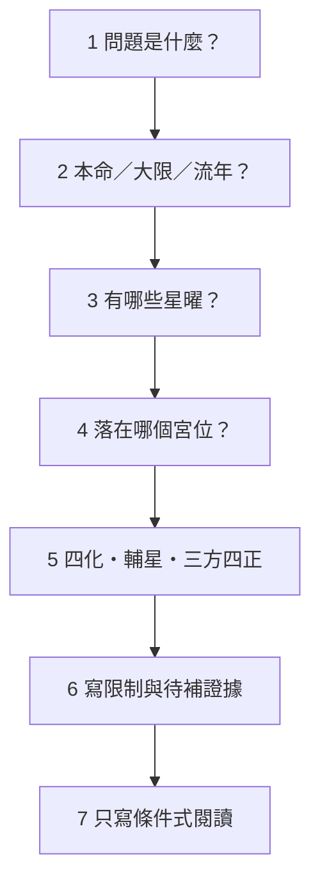

# 紫微斗數新手判讀工作紙

上一站：[[紫微斗數練習與工具-索引]]｜護欄：[[紫微斗數學習安全邊界]]｜下一站：[[十四主星辨識練習]]

## 一句話先懂

先寫問題、時間層與證據，再寫有限度的符號解讀。

## 先備知識

- 了解[[紫微斗數本命大限流年判讀順序]]的三層次。
- 知道[[紫微斗數三方四正入門]]要求看整組關係，不只看單點。

## 學習目標

1. 依固定欄位記錄題目、星曜、宮位、四化與三方四正。
2. 把「索引支持的觀察」和「不能推出的現實結論」分開。
3. 用[[紫微斗數判讀證據檢核表]]自查遺漏。

## 自足小抄

填表順序：**問題→時間層→星曜→宮位→四化／輔星→三方四正→限制**。本命、大限、流年是課程的學習順序；時間層本身不是事件保證。

## 白話比喻

這張工作紙像實驗紀錄表：先寫問題與看到的材料，最後才寫暫時解釋。這個比喻只提醒「先證據、後結論」，不證明命理有效。

## 逐步理解

1. **問題**：把問題縮成一個可檢查的主題，不從整張盤無限發散。
2. **時間層**：標明本命、大限或流年；若混合層次，就分列。
3. **星曜**：記主星，再記題目提供的輔星或雜曜。
4. **宮位**：只用宮位的觀察範圍，不把一宮當唯一答案。
5. **四化與三方四正**：寫出哪些條件讓某個象意較顯著。
6. **限制**：列出缺少資料、待考、版本差異與高風險邊界。

## 新手流程（VF）

- **看什麼**：結論前有六道檢查，限制不是附註，而是正式欄位。
- **怎麼看**：每格都能指出題目或既定筆記的依據才往下；缺資料就停在限制。
- **不能推出什麼**：流程完整不等於答案是真實事件，也不能轉成醫療、財務、法律、心理或關係建議。

## 可複製工作紙

| 欄位 | 我的紀錄 |
|---|---|
| 問題 |  |
| 時間層 | 本命／大限／流年／未提供 |
| 主星 |  |
| 輔星／雜曜 |  |
| 宮位 |  |
| 四化 |  |
| 三方四正 |  |
| 索引支持的觀察 |  |
| 缺少或待考 |  |
| 不能推出 |  |

## 虛構例子

虛構題目只給「本命層、天機與太陰同宮」，未給宮位、四化或三方四正。工作紙可以記下「天機與太陰需要比較哪顆較顯著」，但限制欄必須寫「條件不足，不能判定行動速度、個性或事件」。

## 常見誤解

> [!warning] 常見誤解
> - 先想答案再挑證據：應先記題目給了什麼。
> - 把大限或流年當成必發事件：它們只是課程中的時間閱讀層。
> - 缺宮位仍硬下結論：資料不足就是有效答案。

## 自我檢核

1. **只有一顆星可以填結論嗎？** 只能記關鍵字候選；缺宮位、四化與三方四正時，不能推到人格或事件。
2. **發現庚年四化怎麼辦？** 同列 A、B 版本並連回[[庚天干四化的雙版本]]；不能自行擇一。
3. **健康問題可以用疾厄宮回答嗎？** 只能描述傳統符號脈絡；不能診斷或取代醫療。

## 來源卡

- **索引**：I2、I8、I9、I10。
- **段落**：基礎判讀順序、四化層次、十干版本、十二宮限制。
- **證據強度**：多索引整合；命宮無獨立專題，宮位入門與十干歷史含單一來源限制。

## 負責任使用聲明

傳統命理課程的文化與符號閱讀框架，非科學實證的預測工具，也不取代醫療、法律、心理、財務或關係專業判斷。
