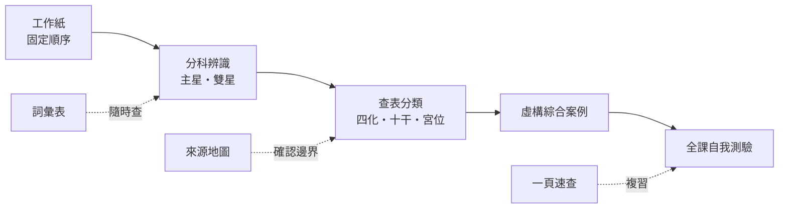

# 紫微斗數練習與工具-索引

上層入口：[[紫微斗數大師課-索引]]｜判讀護欄：[[紫微斗數學習安全邊界]]

## 一句話先懂

這裡把全課概念變成可反覆練習、查表與檢核的安全路徑。

## 先備知識

- 先看過至少一篇主題索引，知道星曜、宮位與四化不是彼此獨立的答案。
- 接受課程符號只能作條件式閱讀，不能取代現實證據或專業判斷。

## 學習目標

1. 依「入門→單元練習→綜合案例→自我測驗」安排複習。
2. 遇到不確定內容時，回到來源地圖確認待考、單一來源或版本衝突。
3. 用工作紙留下證據與限制，而不是只寫結論。

## 自足小抄

- **先做**：[[紫微斗數新手判讀工作紙]]。
- **分科練**：主星、雙星、四化十干、十二宮。
- **整合練**：[[紫微斗數綜合案例練習]]。
- **查名詞**：[[紫微斗數核心詞彙表]]與[[紫微斗數一頁速查表]]。
- **驗證來源**：[[紫微斗數來源地圖與待考索引]]。
- **最後測**：[[紫微斗數全課自我測驗]]。

## 白話比喻

把這組工具想成駕訓班：先認儀表板，再到封閉場地練操作，最後才做綜合測驗。這個比喻只幫助記住學習順序，不是命理規則或證據。

## 逐步理解

1. 從[[紫微斗數新手判讀工作紙]]建立固定提問順序。
2. 用[[十四主星辨識練習]]與[[雙星強弱判讀練習]]練「辨認」和「比較」。
3. 用[[四化與十天干查表練習]]、[[十二宮位情境配對練習]]練查表與分類。
4. 用[[紫微斗數綜合案例練習]]把步驟串起來，但只處理虛構情境。
5. 以[[紫微斗數核心詞彙表]]、[[紫微斗數來源地圖與待考索引]]校正用詞與證據強度。
6. 完成[[紫微斗數全課自我測驗]]，再用[[紫微斗數一頁速查表]]做日後複習。

## 練習路徑圖（VG）

- **看什麼**：每一站訓練的能力不同，來源地圖與詞彙表會橫向支援所有練習。
- **怎麼看**：由左至右前進；答不出時回到對應主題筆記，不靠猜測補答案。
- **不能推出什麼**：完成路徑不代表能預測人生，也不代表任何虛構答案能套到真人。

## 八個主題入口

- [[紫微斗數入門與判讀方法-索引]]
- [[紫微斗數十四主星-索引]]
- [[紫微斗數雙星組合-索引]]
- [[紫微斗數輔星-索引]]
- [[紫微斗數雜曜與四化-索引]]
- [[紫微斗數十天干四化-索引]]
- [[紫微斗數十二宮位與身宮-索引]]
- [[紫微斗數練習與工具-索引]]（目前主題）

## 虛構例子

虛構學員小衡剛看完主星單元。他先做主星辨識，發現自己能背關鍵字卻不會寫限制，於是回到工作紙補上「還要看宮位、四化與三方四正」，再進入雙星練習。這只示範學習補強，不是命盤判讀。

## 常見誤解

> [!warning] 常見誤解
> - 把速查表當成完整判讀：速查表只提醒步驟，不能取代證據檢核。
> - 把練習答案背成斷語：答案只在題目給定條件下成立。
> - 把 QA 通過當成科學驗證：QA 只驗證資料處理與來源邊界。

## 自我檢核

1. **何時該查來源地圖？** 當內容標成待考、單一來源或版本衝突時；不能因課程文字流暢就當成普遍定律。
2. **分科題答對後可以直接替真人下結論嗎？** 不行；仍缺完整脈絡、現實證據與專業評估。
3. **綜合案例的用途是什麼？** 練習串接步驟；不能推出未來事件。

## 來源卡

- **索引**：I1–I10。
- **段落**：十章架構、基礎判讀、十四主星、雙星、輔星、四化、十干與宮位。
- **證據強度**：索引層整合；個別主題仍保留單一來源、待考與庚年雙版本限制，詳見[[紫微斗數來源地圖與待考索引]]。

## 負責任使用聲明

傳統命理課程的文化與符號閱讀框架，非科學實證的預測工具，也不取代醫療、法律、心理、財務或關係專業判斷。
