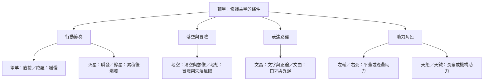

# 紫微斗數輔星索引

## 一句話先懂

> [!abstract] 白話摘要
> 輔星是修飾主星表現的閱讀條件，本索引用六組對照建立安全的學習路線。

## 先備知識與學習目標

- 先備：先讀 [[紫微斗數星曜層級與作用分工]]，理解主星與輔星不是同一層級。
- 目標：能從 [[輔星如何改變主星表現]] 出發，辨認十二輔星的核心意象、成對差異與使用限制。
- 導航：回到 [[紫微斗數大師課-索引]]；學完後前往 [[紫微斗數雜曜與四化-索引]]。

## 自足小抄

- **主星**：教材用來描述命盤主要表現骨架的星曜層級。
- **輔星**：參與執行並改變主星表現方式的條件，不能離開主星與全盤獨立判決。
- **核心意象**：幫助記憶的方向詞，不等於現實事件。
- **成對閱讀**：把相近功能放在一起比較差異，不代表兩星永遠同時出現。

## 白話比喻

主星像樂曲主旋律，輔星像速度、音色與伴奏設定：同一段旋律可以變得直接、緩慢或細膩。這只是記憶橋梁，不是命理規則的證據。

## 逐步理解

1. 先學方法：[[輔星如何改變主星表現]]。
2. 再看節奏與張力：[[輔星擎羊的核心意象與限制]]、[[輔星陀羅的核心意象與限制]]、[[輔星火星的核心意象與限制]]、[[輔星鈴星的核心意象與限制]]。
3. 接著分辨空與冒險：[[輔星地空的核心意象與分類差異]]、[[輔星地劫的核心意象與限制]]。
4. 再看表達路徑：[[輔星文昌的核心意象與限制]]、[[輔星文曲的核心意象與限制]]。
5. 最後比較教材中的助力角色：[[輔星左輔的核心意象與限制]]、[[輔星右弼的核心意象與限制]]、[[輔星天魁的核心意象與限制]]、[[輔星天鉞的核心意象與限制]]。
6. 每次都回到主星、宮位與三方四正；本索引沒有提供單星事件公式。

## 圖解：十二輔星分類地圖

### 圖說三問

- **看什麼**：十二輔星被放進四種學習問題，並以六組差異詞導航。
- **怎麼看**：從中央「修飾條件」向外讀，再點進單星筆記核對限制。
- **不能推出什麼**：分類不代表固定吉凶、事件因果、星曜一定成對出現或任何人的命運。

## 虛構例子

虛構的課堂練習把某主星寫成「重視規劃」。加入文昌卡後，學生只提出「可再觀察它是否較透過文字或文書表現」；加入火星卡後，則提出「可再觀察反應是否更快速」。兩者都是待全盤核對的閱讀問題，不是對人物下結論。

## 常見誤解

> [!warning] 不要把輔星當獨立判決器
> 「有某星就一定發生某事」違反本課來源限制。教材中的男女助力、刑傷、桃花、考運與機構等詞，只是課程模型中的觀察語彙。

## 自我檢核

1. **為什麼先讀方法再讀單星？** 因為輔星只在主星與全盤條件下修飾表現；這不能推出單星能獨立論命。
2. **地空應固定叫煞星嗎？** 不應。本課保留空星／煞星的口徑差異；這不能推出任何流派擁有唯一分類。
3. **助力類星曜能保證遇見貴人嗎？** 不能。教材只提供角色意象，實際情境仍需其他星曜、宮位與現實證據。

## 來源卡

| 上游索引 | 對應節名 | 證據強度 | 使用限制 |
|---|---|---|---|
| I7 | 輔星介紹、擎羊至天鉞 | 十二星為逐字稿與講義交叉整理；介紹為本課單一來源 | 核心詞只能作條件閱讀，地空分類差異不可抹平 |
| V09 | 右弼屬性卡 | 已通過視覺驗證的版面原則 | 插圖只作記憶提示，不是星性證據 |

## 負責任使用

本筆記屬於傳統命理課程的文化與符號閱讀框架，非科學實證的預測工具，也不取代醫療、法律、心理、財務或關係專業判斷。
