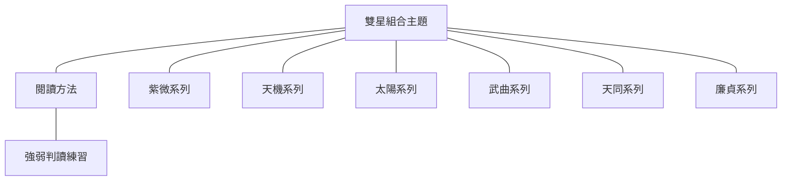

# 紫微斗數雙星組合-索引

> [!abstract] 一句話先懂
> 雙星要讀成受條件影響的組合語意，而不是兩張單星標籤的固定拼接。

## 先備知識

- 回到全課入口：[[紫微斗數大師課-索引]]
- 先認識單星：[[紫微斗數十四主星-索引]]、[[十四主星的閱讀方法]]

## 學習目標

- 先學 [[雙星組合的閱讀方法]]，再依星系分組閱讀二十四組雙星。
- 每次都回看兩顆主星、強弱條件與限制，不把組合當成人格或事件定論。
- 完成閱讀後，用 [[雙星強弱判讀練習]] 檢查自己是否仍保留條件。

## 自足小抄

- **雙星組合**：兩顆主星同時出現時，課程用新的整體語意閱讀它們。
- **強弱**：不是替人排名，而是觀察在特定條件下哪顆星的特質較明顯。
- **條件閱讀**：還要查四化、地支、亮度、三方四正與其他星曜，不能只看名稱。

## 白話比喻

像兩位同學一起做報告，成果會有新的合作風格；誰負責哪一段，還會隨題目與資源改變。

> [!note] 比喻邊界
> 合作報告只是記憶橋梁，不是命理規則證據，也不能拿來替真實人物貼標籤。

## 逐步理解

1. 先拆開辨認兩顆主星各自的核心意象與限制。
2. 再讀本課整理的組合語意，注意它不是固定算式。
3. 比較哪顆星在當下條件較明顯，並保留另一顆星可能改變表現的空間。
4. 最後寫出限制：單一組合不能直接推出性格、職業、關係或事件結果。

## 雙星主題地圖

- **看什麼**：主題先連到閱讀方法，再分成六組導航，最後回到練習。
- **怎麼看**：由方法開始，選一組閱讀；每篇再回鏈兩顆主星。
- **不能推出什麼**：連線只表示學習關聯，不表示星曜之間存在固定因果或運算公式。

## 二十四組雙星導航

### 紫微系列

- [[雙星紫微貪狼]]
- [[雙星紫微天府]]
- [[雙星紫微破軍]]
- [[雙星紫微天相]]
- [[雙星紫微七殺]]

### 天機與太陽系列

- [[雙星天機太陰]]
- [[雙星天機天梁]]
- [[雙星天機巨門]]
- [[雙星太陽太陰]]
- [[雙星太陽巨門]]
- [[雙星太陽天梁]]

### 武曲系列

- [[雙星武曲天府]]
- [[雙星武曲天相]]
- [[雙星武曲七殺]]
- [[雙星武曲破軍]]
- [[雙星武曲貪狼]]

### 天同與廉貞系列

- [[雙星天同太陰]]
- [[雙星天同巨門]]
- [[雙星天同天梁]]
- [[雙星廉貞天相]]
- [[雙星廉貞七殺]]
- [[雙星廉貞破軍]]
- [[雙星廉貞天府]]
- [[雙星廉貞貪狼]]

## 虛構例子

> [!example] 學習路徑
> 小禾先讀方法，再讀一篇紫微系列；他把「哪顆星較明顯」寫成待查問題，而不是立刻替虛構人物下結論。

## 常見誤解

> [!warning] 索引不是速算表
> 雙星名稱只是入口。若跳過兩顆主星、強弱條件與限制，讀到的只是口號，不是本課的完整閱讀方式。

## 自我檢核

1. 為什麼應先讀方法，再讀單一雙星？
2. 雙星名稱能不能單獨預測事件？

> [!question] 參考答案
> 先讀方法，才能把組合語意放回強弱與其他條件；單一名稱不能預測事件，也不能取代完整命盤與現實證據。

## 來源卡

- 核准索引：I5「雙星上半抽取索引」、I6「雙星下半抽取索引」。
- 對應節名：E001–E025 雙星系列；本批方法正文只取 I5，I6 僅用於既定導航涵蓋。
- 證據強度：I5、I6 都是逐字稿與講義的配對校勘索引；I5 支持本篇方法，I6 確認後半組合也須保留周邊條件與非必然限制。
- 不能推出：索引不能證明傳統命理具有科學預測效力，也不能替真實人物做決策。

## 負責任使用

> [!warning] 固定聲明
> 本筆記屬於傳統命理課程的文化與符號閱讀框架，非科學實證的預測工具，也不取代醫療、法律、心理、財務或關係專業判斷。
