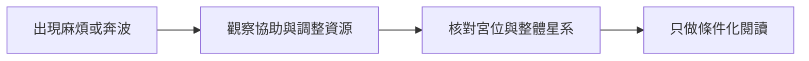

# 雙星天同天梁

> [!abstract] 一句話先懂
> 天同天梁的關鍵是「先遇到麻煩與奔波，再討論是否出現協助或調整」。

## 先備知識

- [[紫微斗數雙星組合-索引]]、[[雙星組合的閱讀方法]]
- [[主星天同的核心意象與限制]]、[[主星天梁的核心意象與限制]]

## 學習目標

- 把「化解」放在「先有事」之後，不誤讀成無事保證。
- 將貴人、信仰／玄學緣與年齡跨度當作條件性描述。

## 自足小抄

本課用「鳥事多但常能化解」、奔波、貴人、信仰／玄學緣與年齡跨度描述這組。「逢凶化吉」的次序是先承認麻煩，再觀察協助或調整；不是自動保護公式。

## 白話比喻

像校慶當天下雨，團隊先處理帳篷與器材，後來才可能因他人協助而完成活動。比喻只說明次序，不保證麻煩被解決。

## 逐步理解

1. 先承認麻煩、奔波或需處理的事。
2. 再觀察貴人、信仰或其他協助如何參與。
3. 最後用整體命盤檢查能否調整；「化吉」不等於事情沒發生或必有好結果。

> [!warning] 信仰與求助邊界
> 信仰是課內助力詮釋，不是宗教成效保證，也不取代實際處置或專業協助。參見 [[紫微斗數學習安全邊界]]。

## 圖解：先有事再化解流程

- **看什麼**：麻煩、協助、整體核對與條件閱讀的先後。
- **怎麼看**：從左往右，不跳過第一步直接讀成吉利結果。
- **不能推出什麼**：箭線只表示閱讀次序，不代表事情必被解決、必有貴人或宗教自動介入。

## 虛構例子

虛構校園專案遇場地取消，後來由另一社團提供空間。練習重點是依序記錄問題與協助，不能用一個虛構成功例證明每次都會化解。

## 常見誤解

- 誤解：天同天梁代表平生沒災沒難。
- 校正：課內明示是先有較多麻煩再討論化解，不是無事保證。

## 自我檢核

1. 「逢凶化吉」的第一步是什麼？
   - 答：先承認問題或奔波；就算後續有協助，也不能推出必然好結果。

## 來源卡

- 上游索引：I6
- 對應節名：S04E020〈天同天梁〉
- 證據強度：配對來源一致；古訣純吉字面已重寫為先有麻煩再化解。
- 限制：化解不等於沒有事情，各情境仍受整體命盤影響。

## 負責任使用

傳統命理課程的文化與符號閱讀框架，非科學實證的預測工具，也不取代醫療、法律、心理、財務或關係專業判斷。
