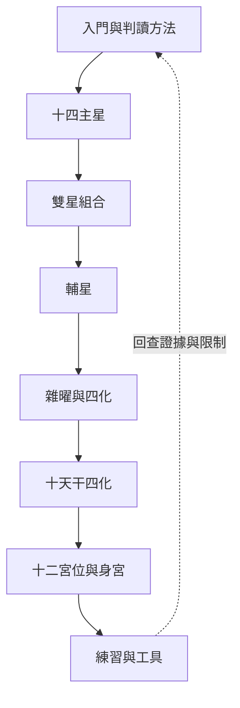

# 紫微斗數大師課-索引

> [!abstract] 一句話先懂
> 這張索引把全課分成八條學習路線，先學符號與方法，再做有證據邊界的綜合練習。

## 先備知識

- 先讀 [[紫微斗數學習安全邊界]]，知道哪些內容能當文化學習、哪些不能拿來替真人做決定。
- 不需先會排盤；遇到陌生詞可先用 [[紫微斗數核心詞彙表]]。

## 學習目標

- 能說出八個主題的先後依賴。
- 能從本頁找到入門、星曜、四化、宮位與練習入口。
- 能在閱讀前先確認來源強度與「不能推出什麼」。

## 自足小抄

- **主題 MOC**：一組筆記的導航頁，不是新增一套判讀規則。
- **索引層**：已把逐字稿與講義的一致、補充、衝突、限制分開整理的核准來源。
- **code-native 圖**：用 Mermaid、SVG、HTML 或表格重繪，只保留已驗證結構，不嵌原講義頁。

## 白話比喻

把全課想成學校的課程地圖：先修課會告訴你從哪裡開始，索引會告訴你下一間教室在哪裡。這只是記憶橋梁，不是紫微斗數規則的證據。

## 逐步理解

1. 先從 [[紫微斗數入門與判讀方法-索引]] 建立閱讀順序與安全界線。
2. 接著依序學 [[紫微斗數十四主星-索引]]、[[紫微斗數雙星組合-索引]] 與 [[紫微斗數輔星-索引]]，從核心符號走向組合和修飾條件。
3. 再讀 [[紫微斗數雜曜與四化-索引]] 與 [[紫微斗數十天干四化-索引]]，辨認作用方向與版本差異。
4. 進入 [[紫微斗數十二宮位與身宮-索引]]，把星曜放回主題與互動位置。
5. 最後用 [[紫微斗數練習與工具-索引]] 練習提出問題、找證據、寫限制，而不是替真人下結論。

## 全課地圖（VG）

- **看什麼**：八個主題由基本元件、組合、作用、位置走向練習，最後回查證據。
- **怎麼看**：沿實線依序學；虛線代表練習後回頭檢核，不表示命盤事件必然循環。
- **不能推出什麼**：這張地圖不是自動算命公式，也不能證明課內符號具有科學預測力。

## 虛構例子

> [!example] 小晴的選課方式
> 虛構學生小晴想理解「三方四正」，她先從入門 MOC 讀命盤結構，再到宮位 MOC，最後以練習工具檢查自己是否同時寫出條件與限制。這個例子只示範導航，不替任何人解盤。

## 常見誤解

> [!warning] 索引不是結論機器
> 看完八個主題仍不代表可以由單星、單宮或單一時間層替真人預測。課程索引只整理本課符號系統與證據強度。

## 自我檢核

1. 為什麼練習之後還要回到入門？答案：因為要重新檢查來源與限制；不能因此推出某個判讀已被現實驗證。
2. 看見陌生的四化版本時應去哪裡？答案：先到十天干四化主題及來源地圖；不能自行選一版當唯一真值。

## 來源卡

| 上游 | 對應內容 | 證據強度與用途 |
|---|---|---|
| R5 | Phase 4 下游證據關卡 | 強；規定只用核准索引，raw 不進成品事實層。 |
| I1–I2 | Ch.01–Ch.10 結構與基礎課 | 中至強；支援課程順序，其中源流課為單一來源。 |
| I3–I10 | 主星至宮位十個教學單元 | 強於本課內交叉校勘；不等於外部科學或史學驗證。 |
| V1 | 教學視覺選擇計畫 | 強於重繪形式；禁止發布原講義頁與命例實值。 |

## 負責任使用

> [!warning] 固定聲明
> 傳統命理課程的文化與符號閱讀框架，非科學實證的預測工具，也不取代醫療、法律、心理、財務或關係專業判斷。

## 背景

- [[本課的紫微斗數來源與流派說法]]
- [[紫微斗數來源地圖與待考索引]]

## 需求

目前無條目。

## 進度

目前無條目。

## 決策

目前無條目。

## 會議

目前無條目。

## 知識

- [[紫微斗數入門與判讀方法-索引]]
- [[紫微斗數十四主星-索引]]
- [[紫微斗數雙星組合-索引]]
- [[紫微斗數輔星-索引]]
- [[紫微斗數雜曜與四化-索引]]
- [[紫微斗數十天干四化-索引]]
- [[紫微斗數十二宮位與身宮-索引]]
- [[紫微斗數練習與工具-索引]]
- [[紫微斗數學習安全邊界]]

## 已封存
