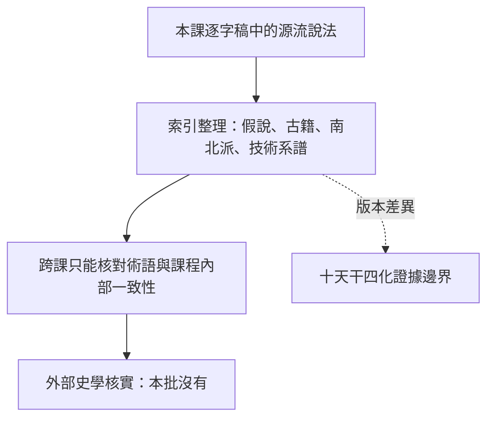

# 本課的紫微斗數來源與流派說法

> [!abstract] 一句話先懂
> 這一課保存講者的源流、古籍與派別說法，但沒有同課講義或外部史料可把它核實為唯一歷史。

## 先備知識

- [[紫微斗數入門與判讀方法-索引]]：先知道來源課在入門路線中的位置。
- [[紫微斗數學習安全邊界]]：先區分課內說法與外部事實。

## 學習目標

- 能說明本課源流內容的證據層級。
- 能分辨「講者陳述」「跨課術語一致」與「外部史學核實」。
- 遇到四化版本差異時，會連到 [[十天干四化的版本與證據邊界]] 查閱。

## 自足小抄

- **單一來源**：只有逐字稿，沒有同課講義可逐項互證。
- **流派說法**：本課談到源流假說、古籍、南北派差異與講者技術系譜；索引沒有提供外部史料驗證。
- **證據降級**：可忠實記錄「本課怎麼說」，不可改寫成「歷史已證明」。

## 白話比喻

像一位老師介紹自己學校的校史：他的說法值得記錄，但要寫正式歷史報告，仍須查看校檔與其他一手資料。比喻只說明證據層級，不判定哪個流派正確。

## 逐步理解

1. I2 記錄 S01E002 談源流假說、古籍、南北派差異與講者自身技術系譜。
2. 這一課沒有 routed 同課講義，因此不能做逐字稿與講義的一致性判定。
3. 後續課程可幫助固定紫微斗數、星曜、宮位與四化等術語，但不能反向證明源流敘述的歷史真實性。
4. 某些系統內容確實存在版本差異；例如十天干四化的化科、化忌差異與庚年雙版本，必須保留衝突。
5. 最穩妥的寫法是「本課主張／本課介紹」，並把未核實處連到 [[紫微斗數來源地圖與待考索引]]。

## 說法與證據層級（VG）

- **看什麼**：課內說法經索引整理後，只能到達課程內部核對；外部核實是尚未補上的另一層。
- **怎麼看**：沿實線辨認證據層級；虛線表示版本差異需要另頁處理，不是因果箭線。
- **不能推出什麼**：不能宣稱本課源流是唯一正統，也不能否定其他流派或裁決歷史真偽。

## 虛構例子

> [!example] 兩種寫法
> 安全寫法：「本課將某段內容放在南北派差異的說明中。」不安全寫法：「歷史證明只有本課這一派正確。」後者超出索引證據。

## 常見誤解

> [!warning] 術語一致不等於史實已核實
> 後續講義也使用相同星名，只能提高課程內部用詞的一致性，不能因此證明古籍年代、傳承路徑或派別主張。

## 自我檢核

1. 為什麼要加「本課」兩字？答案：提醒讀者這是單一課程來源；不能把它當外部史學共識。
2. 庚年有兩種四化表時怎麼辦？答案：並列 A／B 並查版本邊界；不能選一版刪除另一版。

## 來源卡

| 上游 | 對應節名 | 證據強度 |
|---|---|---|
| I2 | S01E002 紫微斗數的由來與派別 | 單一來源；`INSUFFICIENT_DATA: S01E002 同課講義與外部史學核實`。 |
| I9 | 十干歷史、流派與庚年爭議 | 課內多課支持版本差異；不提供唯一流派裁決。 |

## 下一步

- 到 [[十天干四化的版本與證據邊界]] 看具體版本案例，並用 [[紫微斗數來源地圖與待考索引]] 回查所有待考項。

## 負責任使用

> [!warning] 固定聲明
> 傳統命理課程的文化與符號閱讀框架，非科學實證的預測工具，也不取代醫療、法律、心理、財務或關係專業判斷。
