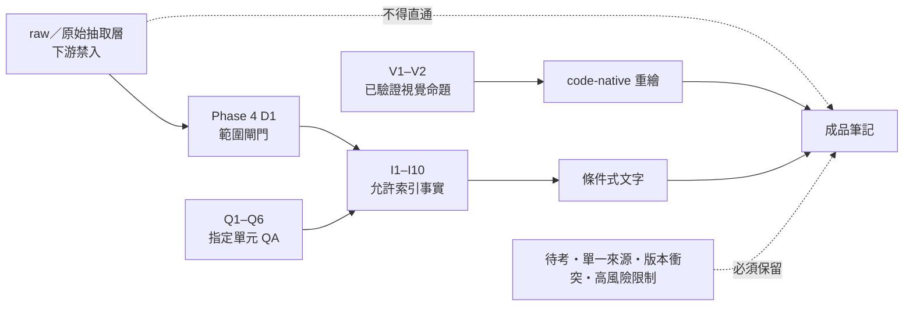

# 紫微斗數來源地圖與待考索引

上一站：[[紫微斗數核心詞彙表]]｜練習入口：[[紫微斗數練習與工具-索引]]｜專案入口：[[紫微斗數大師課-索引]]｜安全邊界：[[紫微斗數學習安全邊界]]｜版本證據：[[十天干四化的版本與證據邊界]]、[[庚天干四化的雙版本]]｜下一站：[[紫微斗數全課自我測驗]]

## 一句話先懂

成品只能用通過門檻的索引事實，待考與 raw 都不能補成教義。

## 先備知識

- 知道「來源存在」不等於「內容已驗證成可教規則」。
- 知道本頁記錄的是證據層級，不是為命理主張增加科學可信度。

## 學習目標

1. 分清 raw、允許索引、QA／視覺驗證與成品四層。
2. 找出待考、單一來源、版本衝突與高風險內容的處理方式。
3. 看見庚年 A、B 邊界，不把表格整齊誤當唯一版本。

## 自足小抄

- **raw／原始抽取層**：下游禁讀、禁引、禁補；本頁不列其路徑或破碎字串。
- **I1–I10 索引層**：成品唯一可用的教學事實入口。
- **Q1–Q6 QA 層**：證明指定資料處理與邊界通過驗收；不會把待考變成事實。
- **V1–V2 視覺層**：只支持已驗證的欄列／空間命題，成品須 code-native 重繪。
- **成品層**：條件式、可追溯、有責任聲明。

## 白話比喻

把來源流程想成飲用水處理：原水不能直接喝，通過檢查的出水也仍有標準與用途限制。這個比喻只幫助理解證據流程，不證明命理內容為真。

## 逐步理解

1. 先由 Phase 4 的 D1 閘門排除 raw 與原始抽取內容。
2. 只在 I1–I10 找可用事實，並保留每個 index 的一致／補充／衝突／限制。
3. 用 Q1–Q6 確認指定單元的資料守恆、待考隔離與範圍控制。
4. 圖形內容只取 V1–V2 已驗證的空間命題，改用 Mermaid／表格／SVG。
5. 撰寫時若遇單一來源、命宮缺課、庚年雙版或高風險內容，直接標示，不抹平。

## 來源→索引→成品（VG）

- **看什麼**：raw 沒有通往成品的直線；成品只接收索引文字與已驗證的 code-native 視覺命題。
- **怎麼看**：由左至右追蹤每句教學內容；遇到限制節點就要在正文與來源卡同步標示。
- **不能推出什麼**：流程與 QA 只能說明資料治理，不能證明傳統命理具有科學預測力。

## 索引地圖

| ID | 可用主題 | 必須保留的邊界 |
|---|---|---|
| I1 | 十章架構與群組講義地圖 | OCR／跨欄與空間語義不能直接線性化；重複頁不算雙重證據 |
| I2 | 基礎、排盤、時間層、三方四正、暗合 | 真太陽時介面數值未驗證；源流說法有單一逐字稿限制 |
| I3 | 十四主星上半 | 單星不得定論；健康、性別與關係內容須限縮 |
| I4 | 十四主星下半 | 待考項已隔離，不得進教學規則 |
| I5 | 雙星上半 | 強弱比較依條件，不是固定公式 |
| I6 | 雙星下半 | 宮位例子不保證事件；待考不得升格 |
| I7 | 十二輔星 | 簡介無配對講義；地空分類存在課內差異 |
| I8 | 雜曜與四化 | 雜曜介紹與部分材料為單一來源；待考不得形成規則 |
| I9 | 十干四化、課程源流與使用限制 | 庚年 A、B 分歧；源流史為課程說法；宗教解方不能承諾效果 |
| I10 | 十二宮與身宮 | 宮位介紹單一來源；命宮無獨立專題；健康／關係／財務等須明示限制 |

## QA 與視覺證據地圖

| ID | 驗證對象 | 可支持的結論 | 仍不能支持 |
|---|---|---|---|
| Q1 | 基礎單元 | 指定輸出、定位、繁體與限制 PASS | 未驗證命盤圖的空間語義 |
| Q2 | 主星下半 | 待考隔離、術語校正與守恆 PASS | 把待考字串寫成星曜規則 |
| Q3 | 雙星下半 | 配對、限制、頁序與低信心處理 PASS | 把雙星例子泛化成固定公式 |
| Q4 | 輔星單元 | 十二輔星與分類差異的索引邊界 PASS | 把角色插圖當成星性證據 |
| Q5 | 雜曜四化 | 四化索引、待考隔離與視覺候選 PASS | 把兩項待考建立為概念節點 |
| Q6 | 群組講義 | 跨卷結構、低文字頁與候選範圍 PASS | 把未驗證版面關係當成教義 |
| V1–V2 | 核心視覺選擇與發現 | 已驗證欄列／箭線／地支字形可重繪 | 嵌入原頁、個資或來源沒有的符號 |

## 待考與衝突索引

### 待考：一律不作教義

- 未能由索引確認的 OCR／ASR 破碎語句：保留在上游隔離層，不在本頁重述。
- 未完成視覺驗證的密集命盤、跨欄與空間關係：不能用線性 OCR 補圖。
- 下游若找不到索引支持，答案就是「資料不足」，不是回頭讀 raw 猜測。

### 單一來源：可描述來源狀態，不可假裝共識

- 基礎源流／歷史說法有無配對講義的情況。
- 輔星、雜曜與十二宮的部分入門介紹只有單側課程材料。
- 十干源流史屬課程說法，不能改寫成已被外部史料證實。
- `INSUFFICIENT_DATA: 本課無獨立命宮專題`。

### 庚年 A、B：真實版本衝突

| 版本 | 化祿 | 化權 | 化科 | 化忌 |
|---|---|---|---|---|
| A | 太陽 | 武曲 | 太陰 | 天同 |
| B | 太陽 | 武曲 | 天同 | 天相 |

兩版共同處是太陽化祿、武曲化權；化科與化忌不同。任何查表、練習或速查表都要同列兩版，詳見[[庚天干四化的雙版本]]。

## 虛構例子

虛構編輯者小岑想在練習答案補上一句上游沒有的星曜斷語。他查 I1–I10 找不到支持，就在答案寫「資料不足，不能推出」，並連回本頁。這是正確的證據處理，不是漏答。

## 常見誤解

> [!warning] 常見誤解
> - QA PASS 等於所有句子都確定：PASS 同時保留待考與限制。
> - raw 比索引更詳細，所以可以直接用：Phase 4 D1 明確禁止。
> - 表格有一列就代表唯一流派：庚年必須同列 A、B。
> - 重複頁是兩份證據：同一內容的重複不增加獨立性。

## 自我檢核

1. **找不到索引支持時怎麼辦？** 標示資料不足並停止；不能讀 raw 或自行補教義。
2. **Q2 通過是否能使用其待考字串？** 不能；Q2 正是驗證待考已被隔離。
3. **庚年哪一版正確？** 本課證據不足以擇一；必須保留 A、B，不能宣稱唯一答案。

## 來源卡

- **規則**：R5（Phase 4 D1 閘門）。
- **索引**：I1–I10；**QA**：Q1–Q6；**視覺**：V1–V2。
- **段落**：索引一致／補充／衝突／限制、QA verdict、視覺 code-native 與隱私邊界。
- **證據強度**：證據治理地圖；QA 驗證資料處理，不驗證命理預測效力。raw 路徑、內容與個資均未納入。

## 負責任使用聲明

傳統命理課程的文化與符號閱讀框架，非科學實證的預測工具，也不取代醫療、法律、心理、財務或關係專業判斷。
